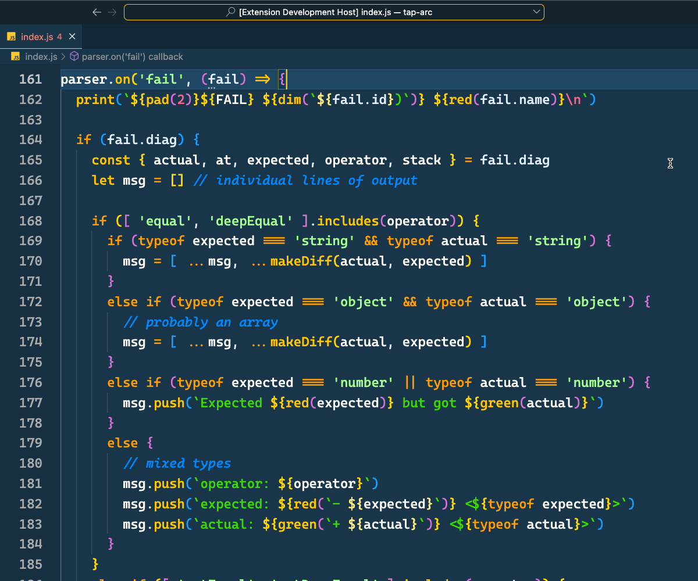

## Toggle JS inlay hints

### Quickly turn on or off all JavaScript inlay hints

Add two VS Code commands to turn on and off all JavaScript inlay hint settings.



The following is set in a user's settings JSON:

```json
{
	"enumMemberValues.enabled": true,
	"functionLikeReturnTypes.enabled": true,
	"parameterNames.enabled": "all",
	"parameterTypes.enabled": true,
	"propertyDeclarationTypes.enabled": true,
	"variableTypes.enabled": true,
}
```
